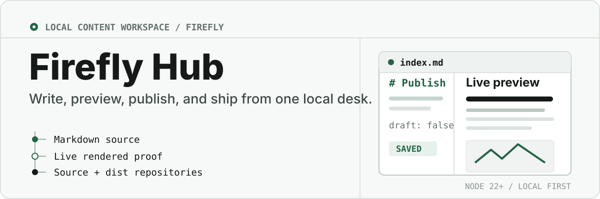
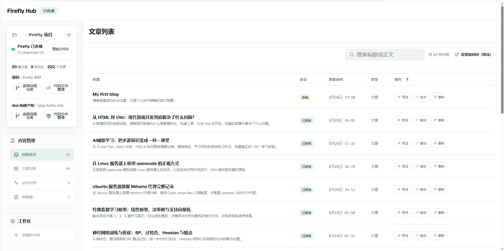
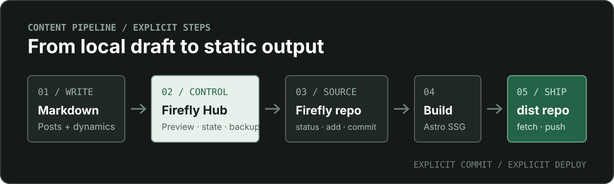
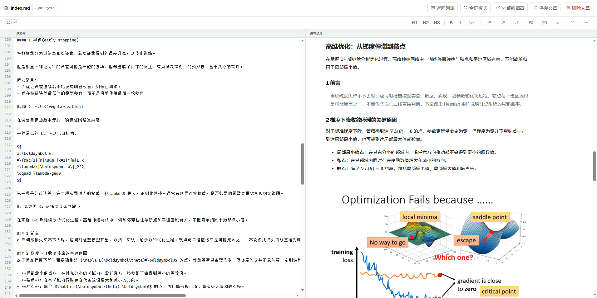
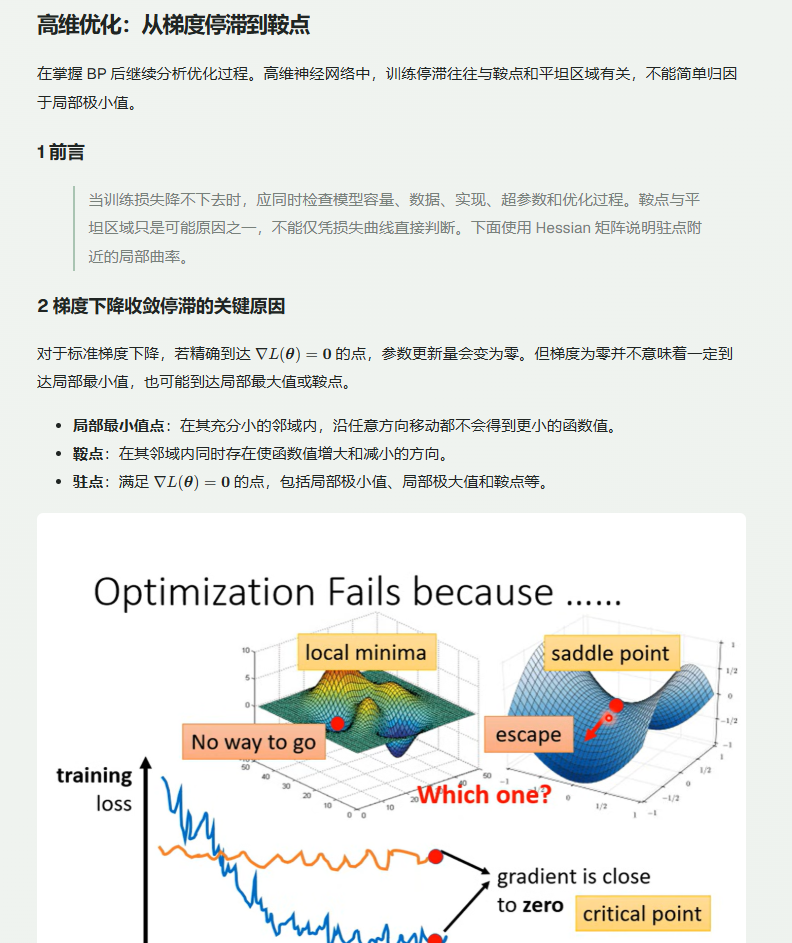
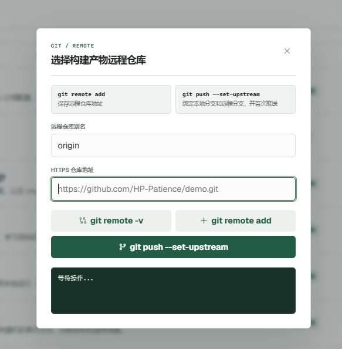
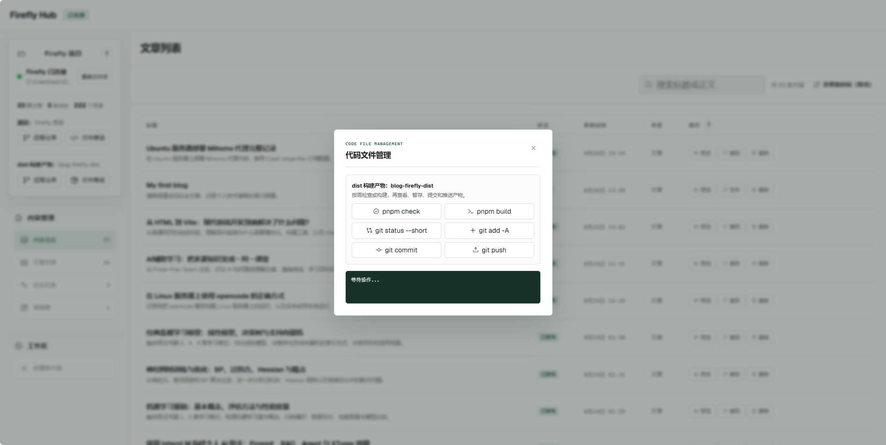

<p align="center">
  
</p>


<p align="center">
  <strong>为 Firefly 博客准备的本地内容与发布工作台。</strong><br>
  写文章、管理动态、实时预览 Markdown，并显式控制源码与构建产物的 Git 流程。
</p>

<p align="center">
  <a href="https://github.com/HP-Patience/Firefly_Hub/stargazers"></a>
  <a href="https://github.com/HP-Patience/Firefly_Hub/forks"></a>
  <a href="https://github.com/HP-Patience/Firefly_Hub/graphs/contributors"></a>
  <a href="https://github.com/HP-Patience/Firefly_Hub/issues"></a>
  <a href="https://github.com/HP-Patience/Firefly_Hub/commits/main"></a>
  <a href="https://nodejs.org/"></a>
</p>

## 先看它如何工作

连接 Firefly 项目文件夹后，Firefly Hub 会读取文章、动态与资源，并在同一个桌面界面中提供搜索、筛选、编辑、发布、构建和推送入口。



## 它解决什么

- **写作与预览在同一处**：左侧编辑完整 Markdown 源文件，右侧实时渲染正文、图片、表格、代码与 KaTeX 公式。
- **内容状态可逆**：文章和动态都能发布或撤回；动态草稿与已发布文件之间可双向迁移。
- **Git 操作不藏步骤**：`status`、`add`、`commit`、`push` 各自独立，内容状态变化不会暗中提交或部署。
- **源码与产物分仓库**：Firefly 源码和 `dist` 构建产物分别管理，构建与推送边界清楚。
- **本地优先**：无登录、注册和权限系统；项目路径、草稿与备份留在本机。

## 工作流

<p align="center">
  
</p>

发布或撤回只改变内容文件及其状态。Git 提交、Astro 检查、静态构建和远程推送都需要明确触发。

## 快速开始

### 环境要求

- Windows
- Node.js 22 或更高版本
- Git
- pnpm，用于检查和构建 Firefly 项目

### 启动工作台

```powershell
git clone https://github.com/HP-Patience/Firefly_Hub.git
cd Firefly_Hub
npm install
npm run dev
```

访问 <http://127.0.0.1:8787/>，点击左侧的“选择文件夹”，连接 Firefly 根目录。生产式启动可使用 `npm start`。

连接后会读取：

```text
src/content/posts/      文章与文章资源
src/content/dynamic/    动态
public/                 公共静态资源
dist/                   构建产物
```

项目路径保存在不会提交的 `data/settings.json` 中。

## 写作体验



编辑器提供行号、同步滚动、原生撤销栈和常用 Markdown 工具栏，并支持：

- 标题、粗体、斜体、引用、列表、链接、图片、表格与代码块
- KaTeX 行内公式 `$...$` 与块级公式 `$$...$$`
- 将本地图片上传到当前文章目录的 `assets/`
- `Ctrl + S` 保存，`Ctrl + Z` 撤销，`Ctrl + Y` 恢复
- 使用系统默认外部编辑器打开源文件

Markdown 由 `marked` 渲染，公式由 `marked-katex-extension` 与 `katex` 渲染。Geist Variable、Phosphor Icons、KaTeX 样式和字体均由本地提供，不依赖 CDN。

<details>
<summary><strong>查看独立只读预览</strong></summary>



</details>

## 内容模型

| 类型 | 草稿与发布 | 元数据 | 文件位置 |
| --- | --- | --- | --- |
| 文章 | 通过 `draft` 状态发布或撤回 | 标题、摘要、分类、标签、作者、封面、来源、置顶、评论 | `src/content/posts/` |
| 动态 | 本地草稿与已发布 Markdown 双向迁移 | 正文、图片、位置、发布时间、置顶 | `data/content.json` / `src/content/dynamic/` |

内容总览支持按文章、动态和草稿筛选，搜索标题或正文，按更新时间排序，并在外部文件变化后自动刷新。

## 源码与 dist 双仓库

Firefly Hub 将两个工作目录视为独立 Git 仓库：

```text
Firefly/         → 源码仓库，例如 blog-firefly
Firefly/dist/    → 构建产物仓库，例如 blog-firefly-dist
```

每个仓库都提供独立的远程配置与文件管理入口。首次源码推送会在缺少 upstream 时设置上游；dist 推送会先 `fetch`，再使用 `--force-with-lease`，避免无保护的强制推送。

<details>
<summary><strong>远程仓库配置</strong></summary>



```bash
git remote -v
git remote add <别名> <HTTPS 地址>
git push --set-upstream <别名> <当前分支>
```

</details>

<details>
<summary><strong>代码文件管理与实时输出</strong></summary>



```bash
git status --short
git add -A
git commit
git push
```

命令通过流式子进程执行。stdout 与 stderr 会实时追加，ANSI 控制字符会被清理，输出区显示最终退出码；执行期间其它命令按钮会暂时禁用，避免输出混合。

</details>

## 检查与构建

```bash
pnpm check
pnpm build
```

- `pnpm check` 只检查 Astro 项目。
- `pnpm build` 执行完整静态构建、图标生成与 Pagefind 索引。

Firefly 使用 Astro 静态输出模式，因此构建是全量的，不会根据 Git diff 增量生成页面。

## 数据安全

文章保存采用临时文件替换，避免中途写入留下半截文件。保存前的备份位于 `data/backups/`，不会进入 Firefly 的内容目录或被 Astro 扫描。

```text
data/content.json     尚未写入 Firefly 的本地草稿
data/settings.json    当前连接的 Firefly 路径
data/backups/         内容备份
```

`data/settings.json` 和 `data/backups/` 不会提交到远程仓库。删除内容是不可逆操作，执行前会显示确认弹窗。

## 适用边界

- 这是本地工具，不提供多用户协作、登录或远程权限控制。
- 当前面向 Windows 与 Firefly 的目录约定，不是通用 CMS。
- 内容发布状态不会自动触发 Git、构建或部署。
- 构建速度取决于文章数量、Markdown 插件和静态资源体积。

## 技术组成

`Node.js HTTP` · `HTML` · `CSS` · `JavaScript` · `marked` · `KaTeX` · `Geist Variable` · `Phosphor Icons`

项目保持无前端框架的本地工作台结构，数据通过 JSON 与 Firefly Markdown 文件持久化。
